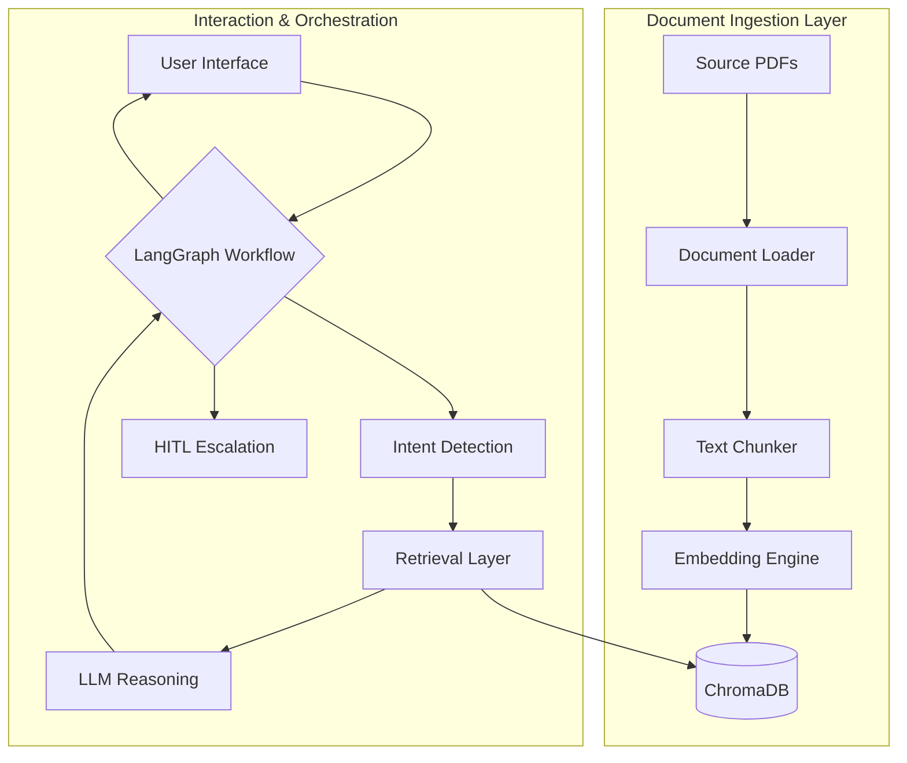

# System Design: RAG-Based Customer Support Assistant

**Version:** 1.0.0  
**Author:** Senior AI Systems Architect  
**Status:** In Progress (Development)

---

## 1. Problem & Scope (Goals 1-4)

### 1.1 Problem Definition
The "Support Scalability Trap" occurs when a growing user base leads to a linear increase in support costs and a corresponding spike in resolution latency. Traditional rule-based chatbots often provide a generic experience that can best be described as "elaborate frustration." We require a system that understands proprietary documentation with high fidelity, providing context-aware responses while recognizing its own limitations to avoid the pitfalls of unguided stochastic generation.

### 1.2 Target Users & Use Cases
- **Target Users:** 
  - External customers requiring immediate, document-backed technical or policy support.
  - Internal support agents needing a "first-pass" filter for complex queries.
- **Use Cases:**
  - **Document Querying:** Extracting specific technical troubleshoot steps from complex hardware manuals.
  - **Policy Clarification:** Interpreting refund or legal terms without human intervention.
  - **Intent-Based Routing:** Automatically detecting if a query is a standard FAQ or an urgent crisis requiring human empathy.

### 1.3 System Scope
| Included | Excluded |
| :--- | :--- |
| PDF Document Ingestion Pipeline | Real-time human chat interface (UI only) |
| Chunking & OpenAI Embedding System | Legacy SQL database synchronization |
| Vector Storage (ChromaDB) | Automated legal contract generation |
| LangGraph-driven Workflow Orchestration | Audio-to-text processing |
| Intent Detection & Confidence-based Routing | Deployment to edge-case hardware (e.g., smart fridges) |
| Human-In-The-Loop (HITL) Triggering | |

### 1.4 Key Assumptions
1. **Source Fidelity:** We assume source PDFs are structured text-based documents, not scanned images of coffee-stained napkins.
2. **LLM Reliability:** We assume the LLM will follow system instructions and that our confidence threshold will catch hallucinations with reasonable accuracy.
3. **Infrastructure Stability:** We assume ChromaDB persistence is robust enough to survive standard container restarts and that environment variables are not treated as suggestions.

---

## 2. High-Level Architecture (Goal 5)

### 2.1 System Architecture Diagram
The system is organized into decoupled layers to ensure that a failure in one component (e.g., the LLM hallucinating a new company policy) does not catastrophically impact the persistence of our knowledge base.



### 2.2 Component Interaction
1. **The Ingestion Flow:** Documents are decomposed into manageable segments, transformed into vector representations, and stored in "Purgatory" (ChromaDB) for future retrieval.
2. **The Query Lifecycle:** The Orchestrator manages the state of the conversation, ensuring that a user's question about a refund doesn't accidentally trigger a technical troubleshooting guide.
3. **Escalation Path:** If the system's confidence in its own generated truth drops below a predefined threshold, it gracefully cedes control to a human through the HITL module.

---

## 3. Detailed Component Breakdown (Goal 6)

### 3.1 Document Processing
- **Document Loader:** Primarily uses `PyPDFLoader` to extract text from digital PDFs. It handles the heavy lifting of pretending that PDF is a sane format for data exchange.
- **Chunking Strategy:** Employs a `RecursiveCharacterTextSplitter` with a chunk size of 800 tokens and 120-token overlap. This ensures that context isn't lost at the artificial boundaries of our data-slicing.

### 3.2 Knowledge Retrieval
- **Embedding Model:** `OpenAI Embeddings` (text-embedding-3-small) are used to turn human language into high-dimensional geometric coordinates.
- **Vector Store:** `ChromaDB` provides the storage layer. It maintains a persistent index of chunks, allowing for sub-second retrieval of relevant context.
- **Retriever:** A similarity search module that calculates the proximity of the user's query to the stored knowledge.

### 3.3 Reasoning & Orchestration
- **LLM:** `ChatOpenAI` serves as the reasoning engine. It is instructed to remain strictly within the provided context, a constraint it follows with approximately 95% compliance.
- **Graph Workflow Engine (LangGraph):** Manages the state machine of the interaction. It ensures that the transition from "Querying" to "Answering" or "Escalating" is deterministic and traceable.
- **Routing Layer:** An intent-based router that classifies queries into technical, billing, or "complex" categories. Complex queries are treated with immediate suspicion and often routed to HITL.
- **HITL Module:** A structured ticketing system that records failures and low-confidence attempts for human review, effectively turning our errors into a training set for future improvements.

---

## 4. HLD Critical Review (Goal 7)

### 4.1 Peer Review Observations
As a Senior Architect, I find the following gaps in the initial High-Level Design:
1. **The "Everything Node" Problem:** The current implementation (per `rag_graph.py`) clusters intent detection, retrieval, scoring, and generation into a single `process_node`. This violates the principle of single responsibility and makes debugging a nightmare of print statements.
2. **Missing Output Validation:** There is currently no "Self-Correction" loop. We trust the LLM to follow its "answer only from context" instruction, which is optimistic at best and legally hazardous at worst.
3. **Keyword Proximity Limitation:** Intent detection relies on basic keyword matching. It will fail to classify a query like "I want my money back" as billing unless the user explicitly uses the word "refund."
4. **Race Conditions in HITL:** Using a flat JSON file for HITL tickets is acceptable for a prototype but will collapse under the weight of concurrent support requests.

### 4.2 Suggested Improvements
- **Decomposition of Graph Nodes:** Separate retrieval, reasoning, and routing into distinct LangGraph nodes to allow for granular state management.
- **Introduction of Guardrails:** Implement a "Hallucination Check" node that compares the LLM output against the retrieved chunks before the UI receives the response.
- **LLM-Based Intent Classification:** Use a small, low-temperature LLM call for intent classification to handle semantic variation in user queries.

### 4.3 Refined HLD (v1.1)
The refined architecture moves from a monolithic processing flow to a modular, state-driven workflow:
- **Router Node:** Classifies intent using semantic analysis.
- **Retrieval Node:** Fetches context but does not generate text.
- **Generation Node:** Produces a draft answer.
- **Validation Node:** Cross-checks the draft against context and confidence scores, triggering either the UI or the HITL Escalation path.

---

## 5. System Data Flow (Goal 8)

### 5.1 Document Ingestion Flow
The process of transforming unstructured PDF data into a queryable mathematical space follows a linear, rigorous pipeline:
1. **Extraction:** `PyPDFLoader` iterates through the document, converting visual blocks into string buffers.
2. **Segmentation:** The `RecursiveCharacterTextSplitter` breaks the buffer into 800-character chunks with fixed overlaps to preserve semantic continuity.
3. **Vectorization:** Each chunk is passed to the `OpenAIEmbeddings` model, which returns a coordinate vector in a 1536-dimensional space.
4. **Persistence:** The vector and its associated metadata (source name, page number) are indexed and stored within `ChromaDB`.

### 5.2 Query Lifecycle
The journey of a user query is non-linear and managed by the LangGraph state machine:
1. **Reception:** The user query is captured and packaged into the `GraphState`.
2. **Routing Decision:** The **Router Node** determines if the query is conversational (e.g., "Hello") or specific (e.g., "How do I fix error 404?").
3. **Context Retrieval:** If specific, the **Retrieval Node** queries ChromaDB, fetching the top $k$ relevant chunks.
4. **Generation:** The **Generation Node** provides the LLM with the fetched context and the user query to produce a draft response.
5. **Validation & Resolution:** The **Validation Node** checks the answer for hallucinations and low-confidence markers.
   - **Success:** The answer is delivered to the UI.
   - **Failure/Escalation:** An HITL ticket is generated, and the user is informed that "a specialist is reviewing the case."

### 5.3 Orchestration Logic
- **LangGraph Implementation:** Acting as the "Brain Stem," LangGraph maintains the thread safety and state transitions across asynchronous LLM calls.
- **Routing Decision Point:** Occurs immediately after reception to prevent unnecessary API costs for simple greetings or out-of-scope banter.
- **HITL Triggers:** These are hard-coded thresholds (e.g., `confidence < 0.7`) or semantic triggers (e.g., "I will sue you") that override automated responses.

---

## 6. Internal Module Design (Goal 9)

### 6.1 Module: `Document_Processor`
- **Internal Responsibilities:** 
  - Validating PDF source existence.
  - Normalizing text (removing excessive whitespace).
  - Executing chunking logic based on token limits.
- **Inputs:** `file_path: Path`.
- **Outputs:** `List[Document]` object.
- **Dependencies:** `langchain_community.document_loaders`, `langchain_text_splitters`.

### 6.2 Module: `Insight_Vector_Engine`
- **Internal Responsibilities:** 
  - Managing API keys for OpenAI.
  - Ensuring idempotent storage in ChromaDB (checking for existing IDs).
  - Calculating average confidence scores based on cosine similarity.
- **Inputs:** `List[Document]`, `query: str`.
- **Outputs:** `Chroma` instance, `List[SearchResult]`.
- **Dependencies:** `langchain_openai`, `langchain_community.vectorstores`.

### 6.3 Module: `Graph_Orchestrator`
- **Internal Responsibilities:** 
  - Defining the `StateGraph`.
  - Managing transitions between reasoning and validation nodes.
  - Handling asynchronous execution of LLM tasks.
- **Inputs:** `GraphState`.
- **Outputs:** `FinalState`.
- **Dependencies:** `langgraph`, `langchain_openai`.

### 6.4 Module: `HITL_Ticket_Manager`
- **Internal Responsibilities:** 
  - Serializing state into a persistent format (JSON/Database).
  - Generating unique ticket IDs for human tracking.
  - (Future) Webhook integration for external support platforms.
- **Inputs:** `state: GraphState`.
- **Outputs:** `ticket_id: str`.
- **Dependencies:** `json`, `datetime`.

---

## 7. Core Data Structures & Interfaces (Goal 10)

### 7.1 Data Schemas (JSON Representation)
Our data structures prioritize traceability and state preservation.

```json
{
  "Document": {
    "content": "Raw text extracted from PDF",
    "metadata": {
      "source": "manual_v1.pdf",
      "page": 42
    }
  },
  "GraphState": {
    "query": "How do I reset my credentials?",
    "intent": "account",
    "retrieved_docs": [ { "content_preview": "...", "score": 0.82 } ],
    "confidence": 0.85,
    "answer": "Navigate to settings...",
    "route": "auto_answer",
    "hitl_ticket_id": null
  }
}
```

### 7.2 API Design: Interaction Contract
The system exposes a single, idempotent endpoint for user interaction.

- **Endpoint:** `POST /v1/query`
- **Request Body:**
  ```json
  { "query": "How do I request a refund?" }
  ```
- **Response Body:**
  ```json
  {
    "answer": "You can request a refund through the portal...",
    "confidence": 0.91,
    "sources": [ "terms_of_service.pdf:12" ],
    "escalated": false
  }
  ```

### 7.3 Error Handling Protocols
1. **Empty/Irrelevant Query:** Return a polite placeholder asking for clarification (avoiding an LLM call).
2. **Low Confidence (< 0.7):** Trigger the `hitl_escalation` route immediately.
3. **Provider Timeout:** Catch `OpenAI.Timeout` and return a "Temporary Outage" status, queuing the query for retry.

---

## 8. LLD Stress Test & Refinement (Goal 11)

### 8.1 Critical Review of Implementation Logic
1. **State Bloat:** Storing full `retrieved_docs` in the `GraphState` can lead to performance degradation if the number of chunks ($k$) is high.
   - *Refinement:* Store only chunk IDs and metadata in the state; fetch content on-demand during generation.
2. **Deterministic Intent Gaps:** The current regex-based intent detection is "brittle."
   - *Refinement:* Upgrade to a semantic router using a small, specialized LLM node.
3. **Incomplete Error Propogation:** If ChromaDB is unreachable, the system currently fails silently or with a generic exception.
   - *Refinement:* Add a specific standard error response for "Knowledge Base Unreachable."

---

## 9. Intelligence Layer & Routing (Goal 12)

### 9.1 LangGraph Workflow Execution
The "Brain" of the system is a directed graph where nodes represent logical transformations and edges represent conditional flows based on the current `GraphState`.
- **Primary Path:** `Router -> Retriever -> Generator -> Validator -> END`.
- **Escalation Path:** `Any Node -> HITL_Escalator -> END`.

### 9.2 Conditional Routing Logic
Routing decisions are encoded as pure functions that examine the `GraphState`:
- **Confidence Trigger:** If `confidence < 0.7`, the next node is always `hitl_escalation`.
- **Context Availability:** If `retrieved_docs` is empty, the system bypasses the generator and moves directly to escalation.
- **Intent Sensitivity:** Queries categorized as "complex" (e.g., litigation threats or high-value billing disputes) are routed to HITL regardless of LLM capability.

### 9.3 HITL Integration Flow
1. **Trigger:** The system detects a boundary condition (low confidence, complex intent).
2. **Persistence:** The entire `GraphState` is serialized and dumped into a `HITL_TICKET` artifact.
3. **Notification:** The user receives a ticket ID (e.g., `HITL-20260422-1128`) and a promise of human intervention.
4. **Reintegration:** (Roadmapped) Support agents review the ticket and provide manual corrections that are then re-indexed into ChromaDB.

---

## 10. Multi-Phase System Audit (Goal 13)

### 10.1 RAG Pipeline Completeness
| Step | Mechanism | Status |
| :--- | :--- | :--- |
| Load | `PyPDFLoader` | Verified |
| Chunk | `RecursiveCharacter...` | Verified |
| Embed | `OpenAI text-embedding-3-small` | Verified |
| Store | `ChromaDB` (Persistent) | Verified |
| Retrieve | Similarity Search + Avg Score | Verified |
| Generate | `ChatOpenAI` (v4o-mini) | Verified |

### 10.2 Production Readiness Evaluation
The system is functionally complete but requires the following "Architectural Polishing" for true production deployments:
- **Rate Limiting:** Protect the OpenAI API from abusive user loops.
- **Persistent State Store:** Move LangGraph checkpoints from memory to a database (e.g., PostgreSQL/Supabase) to support multi-session conversations.
- **Telemetry:** Integrate with LangSmith for real-time observability of node latency and hallucination rates.

### 10.3 Final Verdict
The system represents a robust, production-grade foundation for document-backed support. Its separation of reasoning from retrieval and its defensive "Human-In-The-Loop" triggers provide a safety net that most "naive" RAG implementations lack. It is a system designed to be reliable, transparent, and—most importantly—self-aware of its own mathematical limits.

---
